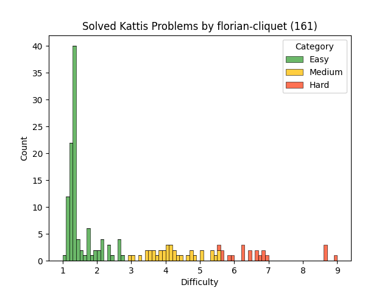

# Kattis Solutions

## Total problems solved: 122

## Repartition chart

Note that the tables below are auto-generated using a script.

|Problem Name|Solution|Difficulty|Category|Problem Link|
|:---|:---|:---|:---|:---|
|[ABC](https://open.kattis.com/problems/abc)||2.0|Easy|[Problem](https://open.kattis.com/problems/abc)|
|[Adding Trouble](https://open.kattis.com/problems/addingtrouble)||1.3|Easy|[Problem](https://open.kattis.com/problems/addingtrouble)|
|[Add Two Numbers](https://open.kattis.com/problems/addtwonumbers)||1.3|Easy|[Problem](https://open.kattis.com/problems/addtwonumbers)|
|[Á leið í bíó](https://open.kattis.com/problems/aleidibio)||1.1|Easy|[Problem](https://open.kattis.com/problems/aleidibio)|
|[Amerískur vinnustaður](https://open.kattis.com/problems/ameriskur)||1.3|Easy|[Problem](https://open.kattis.com/problems/ameriskur)|
|[Autori](https://open.kattis.com/problems/autori)||1.2|Easy|[Problem](https://open.kattis.com/problems/autori)|
|[Barcelona](https://open.kattis.com/problems/barcelona)||1.3|Easy|[Problem](https://open.kattis.com/problems/barcelona)|
|[Bazaar](https://open.kattis.com/problems/bazaar)||5.3|Medium|[Problem](https://open.kattis.com/problems/bazaar)|
|[BergMál](https://open.kattis.com/problems/bergmal)||1.2|Easy|[Problem](https://open.kattis.com/problems/bergmal)|
|[Besta gjöfin](https://open.kattis.com/problems/bestagjofin)||1.3|Easy|[Problem](https://open.kattis.com/problems/bestagjofin)|
|[Betting](https://open.kattis.com/problems/betting)||1.3|Easy|[Problem](https://open.kattis.com/problems/betting)|
|[Bijele](https://open.kattis.com/problems/bijele)||1.3|Easy|[Problem](https://open.kattis.com/problems/bijele)|
|[Bitte ein Bit](https://open.kattis.com/problems/bitteeinbit)||1.3|Easy|[Problem](https://open.kattis.com/problems/bitteeinbit)|
|[Blaðra](https://open.kattis.com/problems/bladra2)||1.3|Easy|[Problem](https://open.kattis.com/problems/bladra2)|
|[Blandað Best](https://open.kattis.com/problems/blandadbest)||1.2|Easy|[Problem](https://open.kattis.com/problems/blandadbest)|
|[Bob](https://open.kattis.com/problems/bob)||5.7|Medium|[Problem](https://open.kattis.com/problems/bob)|
|[Book Shelves](https://open.kattis.com/problems/bokhyllor)||3.6|Medium|[Problem](https://open.kattis.com/problems/bokhyllor)|
|[Bounding Robots](https://open.kattis.com/problems/boundingrobots)||2.0|Easy|[Problem](https://open.kattis.com/problems/boundingrobots)|
|[Call for Problems](https://open.kattis.com/problems/callforproblems)||1.3|Easy|[Problem](https://open.kattis.com/problems/callforproblems)|
|[Solving for Carrots](https://open.kattis.com/problems/carrots)||1.3|Easy|[Problem](https://open.kattis.com/problems/carrots)|
|[Chanukah Challenge](https://open.kattis.com/problems/chanukah)||1.3|Easy|[Problem](https://open.kattis.com/problems/chanukah)|
|[Clinic](https://open.kattis.com/problems/clinic)||3.9|Medium|[Problem](https://open.kattis.com/problems/clinic)|
|[Cold-puter Science](https://open.kattis.com/problems/cold)||1.3|Easy|[Problem](https://open.kattis.com/problems/cold)|
|[Cosmic Path Optimization](https://open.kattis.com/problems/cosmicpathoptimization)||1.3|Easy|[Problem](https://open.kattis.com/problems/cosmicpathoptimization)|
|[Costume Contest](https://open.kattis.com/problems/costumecontest)||1.9|Easy|[Problem](https://open.kattis.com/problems/costumecontest)|
|[Count the Vowels](https://open.kattis.com/problems/countthevowels)||1.3|Easy|[Problem](https://open.kattis.com/problems/countthevowels)|
|[Dagatal](https://open.kattis.com/problems/dagatal)||1.3|Easy|[Problem](https://open.kattis.com/problems/dagatal)|
|[Decimal deletion](https://open.kattis.com/problems/decimaldeletion)||1.3|Easy|[Problem](https://open.kattis.com/problems/decimaldeletion)|
|[Digit Swap](https://open.kattis.com/problems/digitswap)||1.2|Easy|[Problem](https://open.kattis.com/problems/digitswap)|
|[Draga Frá](https://open.kattis.com/problems/dragafra)||1.1|Easy|[Problem](https://open.kattis.com/problems/dragafra)|
|[MeTube](https://open.kattis.com/problems/dutub)||3.7|Medium|[Problem](https://open.kattis.com/problems/dutub)|
|[Echo Echo Echo](https://open.kattis.com/problems/echoechoecho)||1.2|Easy|[Problem](https://open.kattis.com/problems/echoechoecho)|
|[Eksplozija](https://open.kattis.com/problems/eksplozija)||7.3|Hard|[Problem](https://open.kattis.com/problems/eksplozija)|
|[Factstone Benchmark](https://open.kattis.com/problems/factstone)||4.0|Medium|[Problem](https://open.kattis.com/problems/factstone)|
|[Färgrobot](https://open.kattis.com/problems/fargrobot)||1.7|Easy|[Problem](https://open.kattis.com/problems/fargrobot)|
|[Fibs og Dibs](https://open.kattis.com/problems/fibsogdibs)||6.0|Hard|[Problem](https://open.kattis.com/problems/fibsogdibs)|
|[Framtíðar FIFA](https://open.kattis.com/problems/fifa)||1.1|Easy|[Problem](https://open.kattis.com/problems/fifa)|
|[Finding An A](https://open.kattis.com/problems/findingana)||1.2|Easy|[Problem](https://open.kattis.com/problems/findingana)|
|[Flatbökuveisla](https://open.kattis.com/problems/flatbokuveisla)||1.1|Easy|[Problem](https://open.kattis.com/problems/flatbokuveisla)|
|[Framvindustika](https://open.kattis.com/problems/framvindustika)||3.4|Medium|[Problem](https://open.kattis.com/problems/framvindustika)|
|[Frogger](https://open.kattis.com/problems/frogger)||5.5|Medium|[Problem](https://open.kattis.com/problems/frogger)|
|[Frumtölutalning](https://open.kattis.com/problems/frumtolutalning)||8.5|Hard|[Problem](https://open.kattis.com/problems/frumtolutalning)|
|[FYI](https://open.kattis.com/problems/fyi)||1.3|Easy|[Problem](https://open.kattis.com/problems/fyi)|
|[Greedily Increasing Subsequence](https://open.kattis.com/problems/greedilyincreasing)||1.9|Easy|[Problem](https://open.kattis.com/problems/greedilyincreasing)|
|[Greetings!](https://open.kattis.com/problems/greetings2)||1.3|Easy|[Problem](https://open.kattis.com/problems/greetings2)|
|[I Can Guess the Data Structure!](https://open.kattis.com/problems/guessthedatastructure)||2.7|Easy|[Problem](https://open.kattis.com/problems/guessthedatastructure)|
|[Hello World!](https://open.kattis.com/problems/hello)||1.1|Easy|[Problem](https://open.kattis.com/problems/hello)|
|[Hipp Hipp](https://open.kattis.com/problems/hipphipp)||1.1|Easy|[Problem](https://open.kattis.com/problems/hipphipp)|
|[Hipp Hipp Húrra](https://open.kattis.com/problems/hipphipphurra)||1.2|Easy|[Problem](https://open.kattis.com/problems/hipphipphurra)|
|[Hissing Microphone](https://open.kattis.com/problems/hissingmicrophone)||1.3|Easy|[Problem](https://open.kattis.com/problems/hissingmicrophone)|
|[How Many Digits?](https://open.kattis.com/problems/howmanydigits)||4.1|Medium|[Problem](https://open.kattis.com/problems/howmanydigits)|
|[Hraðgreining](https://open.kattis.com/problems/hradgreining)||1.2|Easy|[Problem](https://open.kattis.com/problems/hradgreining)|
|[Input Scandal](https://open.kattis.com/problems/inputscandal)||1.8|Easy|[Problem](https://open.kattis.com/problems/inputscandal)|
|[IsItHalloween.com](https://open.kattis.com/problems/isithalloween)||1.3|Easy|[Problem](https://open.kattis.com/problems/isithalloween)|
|[Is Y a Vowel?](https://open.kattis.com/problems/isyavowel)||1.3|Easy|[Problem](https://open.kattis.com/problems/isyavowel)|
|[Jabuke](https://open.kattis.com/problems/jabuke)||1.7|Easy|[Problem](https://open.kattis.com/problems/jabuke)|
|[Jack-O'-Lantern Juxtaposition](https://open.kattis.com/problems/jackolanternjuxtaposition)||1.2|Easy|[Problem](https://open.kattis.com/problems/jackolanternjuxtaposition)|
|[Jumbo Javelin](https://open.kattis.com/problems/jumbojavelin)||1.3|Easy|[Problem](https://open.kattis.com/problems/jumbojavelin)|
|[Kemija](https://open.kattis.com/problems/kemija)||8.6|Hard|[Problem](https://open.kattis.com/problems/kemija)|
|[Keys, Phone, Wallet](https://open.kattis.com/problems/keysphonewallet)||1.3|Easy|[Problem](https://open.kattis.com/problems/keysphonewallet)|
|[Kiki Boba](https://open.kattis.com/problems/kikiboba)||1.3|Easy|[Problem](https://open.kattis.com/problems/kikiboba)|
|[Cutting Proteins](https://open.kattis.com/problems/klippaprotein)||5.2|Medium|[Problem](https://open.kattis.com/problems/klippaprotein)|
|[Knight Packing](https://open.kattis.com/problems/knightpacking)||1.3|Easy|[Problem](https://open.kattis.com/problems/knightpacking)|
|[Codforces](https://open.kattis.com/problems/kodkraft)||5.4|Medium|[Problem](https://open.kattis.com/problems/kodkraft)|
|[Kveðja](https://open.kattis.com/problems/kvedja)||1.1|Easy|[Problem](https://open.kattis.com/problems/kvedja)|
|[Last Factorial Digit](https://open.kattis.com/problems/lastfactorialdigit)||1.4|Easy|[Problem](https://open.kattis.com/problems/lastfactorialdigit)|
|[Leggja saman](https://open.kattis.com/problems/leggjasaman)||1.2|Easy|[Problem](https://open.kattis.com/problems/leggjasaman)|
|[Leyniþjónusta](https://open.kattis.com/problems/leynithjonusta)||1.3|Easy|[Problem](https://open.kattis.com/problems/leynithjonusta)|
|[Lubbi Lærir](https://open.kattis.com/problems/lubbilaerir)||1.1|Easy|[Problem](https://open.kattis.com/problems/lubbilaerir)|
|[Metronome](https://open.kattis.com/problems/metronome)||1.1|Easy|[Problem](https://open.kattis.com/problems/metronome)|
|[Millifærsla](https://open.kattis.com/problems/millifaersla)||1.2|Easy|[Problem](https://open.kattis.com/problems/millifaersla)|
|[Missing Gnomes](https://open.kattis.com/problems/missinggnomes)||3.6|Medium|[Problem](https://open.kattis.com/problems/missinggnomes)|
|[Mravojed](https://open.kattis.com/problems/mravojed)||6.5|Hard|[Problem](https://open.kattis.com/problems/mravojed)|
|[Multiplication Table](https://open.kattis.com/problems/multtable)||3.6|Medium|[Problem](https://open.kattis.com/problems/multtable)|
|[Nasty Hacks](https://open.kattis.com/problems/nastyhacks)||1.3|Easy|[Problem](https://open.kattis.com/problems/nastyhacks)|
|[N-sum](https://open.kattis.com/problems/nsum)||1.3|Easy|[Problem](https://open.kattis.com/problems/nsum)|
|[Odd Echo](https://open.kattis.com/problems/oddecho)||1.3|Easy|[Problem](https://open.kattis.com/problems/oddecho)|
|[Oddities](https://open.kattis.com/problems/oddities)||1.3|Easy|[Problem](https://open.kattis.com/problems/oddities)|
|[Öfugsnúið](https://open.kattis.com/problems/ofugsnuid)||1.6|Easy|[Problem](https://open.kattis.com/problems/ofugsnuid)|
|[Otpor](https://open.kattis.com/problems/otpor)||4.0|Medium|[Problem](https://open.kattis.com/problems/otpor)|
|[Óvissa](https://open.kattis.com/problems/ovissa)||1.1|Easy|[Problem](https://open.kattis.com/problems/ovissa)|
|[Patuljci](https://open.kattis.com/problems/patuljci)||1.7|Easy|[Problem](https://open.kattis.com/problems/patuljci)|
|[Pizzastrengur](https://open.kattis.com/problems/pizzastrengur)|Not posted yet|2.8|Easy|[Problem](https://open.kattis.com/problems/pizzastrengur)|
|[Pot](https://open.kattis.com/problems/pot)||1.4|Easy|[Problem](https://open.kattis.com/problems/pot)|
|[Prva](https://open.kattis.com/problems/prva)||1.7|Easy|[Problem](https://open.kattis.com/problems/prva)|
|[Púsluspil](https://open.kattis.com/problems/pusluspil)||2.1|Easy|[Problem](https://open.kattis.com/problems/pusluspil)|
|[Quality-Adjusted Life-Year](https://open.kattis.com/problems/qaly)||1.3|Easy|[Problem](https://open.kattis.com/problems/qaly)|
|[Quadrant Selection](https://open.kattis.com/problems/quadrant)||1.2|Easy|[Problem](https://open.kattis.com/problems/quadrant)|
|[R2](https://open.kattis.com/problems/r2)||1.3|Easy|[Problem](https://open.kattis.com/problems/r2)|
|[Rating Problems](https://open.kattis.com/problems/ratingproblems)||1.4|Easy|[Problem](https://open.kattis.com/problems/ratingproblems)|
|[Reduplication](https://open.kattis.com/problems/reduplikation)||1.1|Easy|[Problem](https://open.kattis.com/problems/reduplikation)|
|[Rúnnfræði](https://open.kattis.com/problems/runnfraedi)||8.6|Hard|[Problem](https://open.kattis.com/problems/runnfraedi)|
|[Sammaeining](https://open.kattis.com/problems/sammaeining)||6.0|Hard|[Problem](https://open.kattis.com/problems/sammaeining)|
|[Shandy](https://open.kattis.com/problems/shandy)||1.3|Easy|[Problem](https://open.kattis.com/problems/shandy)|
|[A Shortcut to What?](https://open.kattis.com/problems/shortcuttowhat)||1.2|Easy|[Problem](https://open.kattis.com/problems/shortcuttowhat)|
|[Silueta](https://open.kattis.com/problems/silueta)||4.9|Medium|[Problem](https://open.kattis.com/problems/silueta)|
|[Skák](https://open.kattis.com/problems/skak)||1.3|Easy|[Problem](https://open.kattis.com/problems/skak)|
|[Sort Two Numbers](https://open.kattis.com/problems/sorttwonumbers)||1.3|Easy|[Problem](https://open.kattis.com/problems/sorttwonumbers)|
|[Spritt](https://open.kattis.com/problems/spritt)||1.3|Easy|[Problem](https://open.kattis.com/problems/spritt)|
|[Stamp Combinations](https://open.kattis.com/problems/stampcombinations)||5.5|Medium|[Problem](https://open.kattis.com/problems/stampcombinations)|
|[Stórafmæli](https://open.kattis.com/problems/storafmaeli)||1.2|Easy|[Problem](https://open.kattis.com/problems/storafmaeli)|
|[Studentsko](https://open.kattis.com/problems/studentsko)||3.8|Medium|[Problem](https://open.kattis.com/problems/studentsko)|
|[Sunshine](https://open.kattis.com/problems/sunshine)| |5.4|Medium|[Problem](https://open.kattis.com/problems/sunshine)|
|[Symmetric Order](https://open.kattis.com/problems/symmetricorder)||1.7|Easy|[Problem](https://open.kattis.com/problems/symmetricorder)|
|[Takkar](https://open.kattis.com/problems/takkar)||1.2|Easy|[Problem](https://open.kattis.com/problems/takkar)|
|[Takk fyrir mig](https://open.kattis.com/problems/takkfyrirmig)||1.2|Easy|[Problem](https://open.kattis.com/problems/takkfyrirmig)|
|[Talnalás](https://open.kattis.com/problems/talnalas)||3.8|Medium|[Problem](https://open.kattis.com/problems/talnalas)|
|[Tarifa](https://open.kattis.com/problems/tarifa)||1.3|Easy|[Problem](https://open.kattis.com/problems/tarifa)|
|[Teningasafn](https://open.kattis.com/problems/teningasafn)||6.6|Hard|[Problem](https://open.kattis.com/problems/teningasafn)|
|[Three Digits](https://open.kattis.com/problems/threedigits)||6.1|Hard|[Problem](https://open.kattis.com/problems/threedigits)|
|[Til hamingju](https://open.kattis.com/problems/tilhamingju)||1.0|Easy|[Problem](https://open.kattis.com/problems/tilhamingju)|
|[Stuck In A Time Loop](https://open.kattis.com/problems/timeloop)||1.3|Easy|[Problem](https://open.kattis.com/problems/timeloop)|
|[Tölvunarfræðingar telja](https://open.kattis.com/problems/tolvunarfraedingartelja)||1.1|Easy|[Problem](https://open.kattis.com/problems/tolvunarfraedingartelja)|
|[Triangle Area](https://open.kattis.com/problems/triarea)||1.2|Easy|[Problem](https://open.kattis.com/problems/triarea)|
|[Triolingo Push](https://open.kattis.com/problems/triolingopush)||6.2|Hard|[Problem](https://open.kattis.com/problems/triolingopush)|
|[Take Two Stones](https://open.kattis.com/problems/twostones)||1.2|Easy|[Problem](https://open.kattis.com/problems/twostones)|
|[Two-sum](https://open.kattis.com/problems/twosum)||1.2|Easy|[Problem](https://open.kattis.com/problems/twosum)|
|[Umferð](https://open.kattis.com/problems/umferd)||1.3|Easy|[Problem](https://open.kattis.com/problems/umferd)|
|[Veður - Lokaðar heiðar](https://open.kattis.com/problems/vedurheidar)||1.3|Easy|[Problem](https://open.kattis.com/problems/vedurheidar)|
|[Velkomin!](https://open.kattis.com/problems/velkomin)||1.0|Easy|[Problem](https://open.kattis.com/problems/velkomin)|
|[Viðsnúningur](https://open.kattis.com/problems/vidsnuningur)||1.2|Easy|[Problem](https://open.kattis.com/problems/vidsnuningur)|
|[Which is Greater?](https://open.kattis.com/problems/whichisgreater)||1.2|Easy|[Problem](https://open.kattis.com/problems/whichisgreater)|
